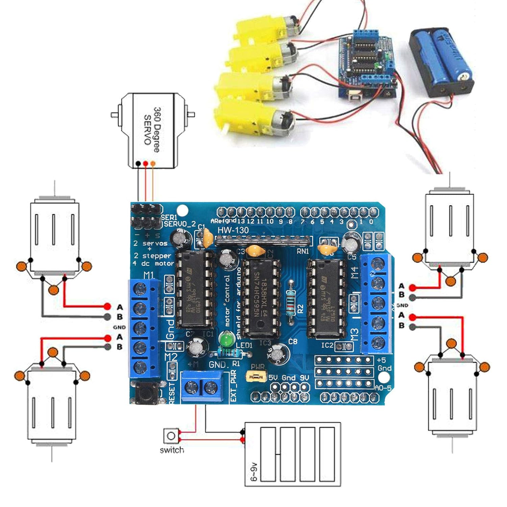

# Roady🎯


## Basic Details
### Team Name: SineWave


### Team Members
- Team Lead: Sidharth V Menon - Saintgits College Engineering
- Member 2: Midhun Mathew - Saintgits College Engineering
- Member 3: Abin Joe Francis - Saintgits College Engineering

### Project Description
Roady is an innovative project designed to assist learner drivers in honing their driving skills. Developed by the team at SineWave, Roady leverages advanced technologies to provide real-time feedback and personalized training modules. The project aims to make the learning process more engaging and effective, ensuring that new drivers gain confidence and competence behind the wheel. Whether it's mastering parallel parking or understanding road signs, Roady is your go-to companion for a safer and smarter driving experience. 🚗💨

### The Problem (that doesn't exist)
The average driver does not have a reliable good driver that can help them with their driving. There are an increasing number of accidents on the road and these risk the lives of people on and off the road(I know it sounds useful but who listens to anyone).

### The Solution (that nobody asked for)
We have made a Machine Learning model that can monitor the driving based on the steering input and tell the driver whether their turns were tight enough.

## Technical Details
### Technologies/Components Used
For Software:
- Python,C
- Arduino IDE, Git, VS Code
- Tensorflow, scikit-learn, motor-driver.h
- chatGPT, Figma, 

For Hardware:
- Arduino UNO, SG90 Servo, Motor Driver Sheild, WebCam
- 
- Arduino IDE, PySerial, Soldering Iron, Foam boards, Hot Glue

### Implementation
For Software:
# Installation
For the model we have used ```Python 3.11``` and as such we are using Tensorflow 12.1.1 and the corresponding numpy version. Arduino IDE version 2.33 with the arduino uno motor driver sheild library is required. The software interface is entirely designed in Figma and is implemented using VS Code.


### Project Documentation
For Software:


This shows all the UI elements designed for this project. It shows the way the UI reacts to various scenarios and what the model output and the UI output for the various cases

For Hardware:

# Schematic & Circuit


We are using a L293D motor driver sheild to power the motors controlling our rover, one side is connected to one set of wheels and the other to another set of wheels. The polarity on the motors provided throught he sheild controls the direction of motion and the direction of movement of the rover.

# Build Photos


### Project Demo
# Video
[Add your demo video link here]
*Explain what the video demonstrates*

# Additional Demos


## Team Contributions
- Sidharth V Menon: Model creation, debugging, Git management
- Midhun Mathew: Arduino programming, circuitry, web page development
- Abin Joe Francis: Dash and interface design and web page design

---
Made with ❤️ at TinkerHub Useless Projects 


